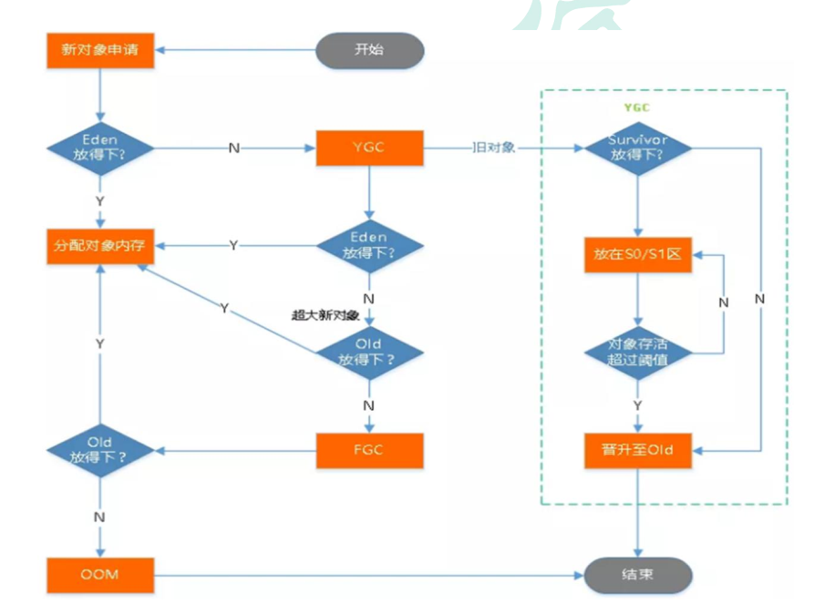
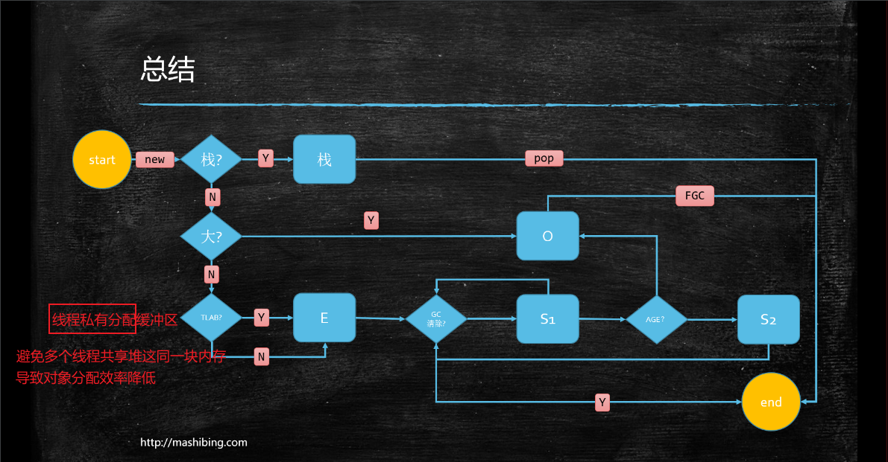

# JVM学习笔记

## 1.ClassFileFormat

### 1.1编译字节码

使用sublime打开我们的 TestClass.class文件

```hex
cafe babe 0000 0034 0016 0a00 0400 1209
0003 0013 0700 1407 0015 0100 016d 0100
0149 0100 063c 696e 6974 3e01 0003 2829
5601 0004 436f 6465 0100 0f4c 696e 654e
756d 6265 7254 6162 6c65 0100 124c 6f63
616c 5661 7269 6162 6c65 5461 626c 6501
0004 7468 6973 0100 234c 636f 6d2f 6a76
6d2f 636c 6173 7346 696c 6546 6f72 6d61
742f 5465 7374 436c 6173 733b 0100 0369
6e63 0100 0328 2949 0100 0a53 6f75 7263
6546 696c 6501 000e 5465 7374 436c 6173
732e 6a61 7661 0c00 0700 080c 0005 0006
0100 2163 6f6d 2f6a 766d 2f63 6c61 7373
4669 6c65 466f 726d 6174 2f54 6573 7443
6c61 7373 0100 106a 6176 612f 6c61 6e67
2f4f 626a 6563 7400 2100 0300 0400 0000
0100 0200 0500 0600 0000 0200 0100 0700
0800 0100 0900 0000 2f00 0100 0100 0000
052a b700 01b1 0000 0002 000a 0000 0006
0001 0000 0007 000b 0000 000c 0001 0000
0005 000c 000d 0000 0001 000e 000f 0001
0009 0000 0031 0002 0001 0000 0007 2ab4
0002 0460 ac00 0000 0200 0a00 0000 0600
0100 0000 0c00 0b00 0000 0c00 0100 0000
0700 0c00 0d00 0000 0100 1000 0000 0200
11
```

### 1.2分析字节码

1. 使用Javap -verbose TestClass.class 编译出字节码内容

   ```java
     Last modified 2021-6-6; size 401 bytes
     MD5 checksum 93646e9c979da4d18206ab4dc0a68f2c
     Compiled from "TestClass.java"
   public class com.jvm.classFileFormat.TestClass
     minor version: 0
     major version: 52
     flags: ACC_PUBLIC, ACC_SUPER
   Constant pool:
      #1 = Methodref          #4.#18         // java/lang/Object."<init>":()V
      #2 = Fieldref           #3.#19         // com/jvm/classFileFormat/TestClass.m:I
      #3 = Class              #20            // com/jvm/classFileFormat/TestClass
      #4 = Class              #21            // java/lang/Object
      #5 = Utf8               m
      #6 = Utf8               I
      #7 = Utf8               <init>
      #8 = Utf8               ()V
      #9 = Utf8               Code
     #10 = Utf8               LineNumberTable
     #11 = Utf8               LocalVariableTable
     #12 = Utf8               this
     #13 = Utf8               Lcom/jvm/classFileFormat/TestClass;
     #14 = Utf8               inc
     #15 = Utf8               ()I
     #16 = Utf8               SourceFile
     #17 = Utf8               TestClass.java
     #18 = NameAndType        #7:#8          // "<init>":()V
     #19 = NameAndType        #5:#6          // m:I
     #20 = Utf8               com/jvm/classFileFormat/TestClass
     #21 = Utf8               java/lang/Object
   {
     public com.jvm.classFileFormat.TestClass();
       descriptor: ()V
       flags: ACC_PUBLIC
       Code:
         stack=1, locals=1, args_size=1
            0: aload_0
            1: invokespecial #1                  // Method java/lang/Object."<init>":()V
            4: return
         LineNumberTable:
           line 7: 0
         LocalVariableTable:
           Start  Length  Slot  Name   Signature
               0       5     0  this   Lcom/jvm/classFileFormat/TestClass;
   
     public int inc();
       descriptor: ()I
       flags: ACC_PUBLIC
       Code:
         stack=2, locals=1, args_size=1
            0: aload_0
            1: getfield      #2                  // Field m:I
            4: iconst_1
            5: iadd
            6: ireturn
         LineNumberTable:
           line 12: 0
         LocalVariableTable:
           Start  Length  Slot  Name   Signature
               0       7     0  this   Lcom/jvm/classFileFormat/TestClass;
   }
   SourceFile: "TestClass.java"
   ```

2. 使用idea插件打开

### 1.3class文件的结构

#### 1.31基本的数据类型:

1. 无符号数

   | 类型      | u1   | u2   | u4   | u8   |
   | --------- | ---- | ---- | ---- | ---- |
   | 大小/字节 | 1    | 2    | 4    | 8    |

2. "_info"结尾的表

#### 1.32十六进制的字节码分别代表:

1. 魔数(Magic Number) 4字节
2. 版本号(Major Version) 4字节  ->52.0  次版本号(.0)+主版本号(52)
3. 常量池(Constant Pool) 
4. 访问标志(access_flags) 2字节
5. 等等...

## 2.JMM

### 2.1一致性

- MESI协议

>Core0修改v后，发送一个信号，将Core1缓存的v标记为失效，并将修改值写回内存。
>
>Core0可能会多次修改v，每次修改都只发送一个信号（发信号时会锁住缓存间的总线），Core1缓存的v保持着失效标记。
>
>Core1使用v前，发现缓存中的v已经失效了，得知v已经被修改了，于是重新从其他缓存或内存中加载v。

- 总线锁

### 2.2乱序

- 硬件

>1.内存屏障 X86
>
>sfence:  store| 在sfence指令前的写操作当必须在sfence指令后的写操作前完成。
>lfence：load | 在lfence指令前的读操作当必须在lfence指令后的读操作前完成。
>mfence：modify/mix | 在mfence指令前的读写操作当必须在mfence指令后的读写操作前完成。
>
>2.原子指令

- JVM级别如何规范（JSR133）

> LoadLoad屏障：
> 	对于这样的语句Load1; LoadLoad; Load2， 
>
> 	在Load2及后续读取操作要读取的数据被访问前，保证Load1要读取的数据被读取完毕。
>
> StoreStore屏障：
>
> 	对于这样的语句Store1; StoreStore; Store2，
> 	
> 	在Store2及后续写入操作执行前，保证Store1的写入操作对其它处理器可见。
>
> LoadStore屏障：
>
> 	对于这样的语句Load1; LoadStore; Store2，
> 	
> 	在Store2及后续写入操作被刷出前，保证Load1要读取的数据被读取完毕。
>
> StoreLoad屏障：
>
> ```
> 对于这样的语句Store1; StoreLoad; Load2，
> 
> 在Load2及后续所有读取操作执行前，保证Store1的写入对所有处理器可见。
> ```

### 2.3volatile的实现细节

1. 字节码层面
   ACC_VOLATILE

2. JVM层面
   volatile内存区的读写 都加屏障

   > StoreStoreBarrier
   >
   > volatile 写操作
   >
   > StoreLoadBarrier

   > LoadLoadBarrier
   >
   > volatile 读操作
   >
   > LoadStoreBarrier

3. OS和硬件层面
   https://blog.csdn.net/qq_26222859/article/details/52235930
   hsdis - HotSpot Dis Assembler
   windows lock 指令实现 | MESI实现

### 2.4synchronized实现细节

1. 字节码层面
   ACC_SYNCHRONIZED
   monitorenter monitorexit
2. JVM层面
   C C++ 调用了操作系统提供的同步机制
3. OS和硬件层面
   X86 : lock cmpxchg
   [https](https://blog.csdn.net/21aspnet/article/details/88571740)[://blog.csdn.net/21aspnet/article/details/](https://blog.csdn.net/21aspnet/article/details/88571740)[88571740](https://blog.csdn.net/21aspnet/article/details/88571740)

## 3.对象创建过程

1. class loading(类加载到内存)
2. class linking(类连接)
   1. verification(验证)
   2. preparation(静态变量给默认值)
   3. resolution(解析)
3. class initializing(静态变量初始值,静态语句块)
4. 申请对象内存
5. 成员变量赋默认值
6. 调用构造方法
   1. 成员变量,成员代码块
   2. 构造方法的方法体

## 4.对象在内存中的存储布局

**普通对象**(new Object() 16字节)

1. 对象头 markword 8字节

2. ==ClassPointer指针==(指向Class对象的指针)   -XX:+UseCompressedClassPointers 为4字节 不开启为8字节

3. 实例数据(8大基本==数据类型==大小,==引用数据类型== -XX:+UseCompressedOops 为4字节 不开启为8字节 ) 

4. padding 对齐(==保证对象的总大小为8的倍数==)

   上面的参数用java -XX:+PrintCommandLineFlags -version 观察虚拟机的配置

   

**数组对象**(new int[]{} 16字节)

比普通对象多一个数组的长度length 4字节

## 5.对象头信息(markword)


## 6.垃圾确认算法

### 6.1Reference Counting(引用计数算法) 

>在对象中添加一个引用计数器,每当有一个地方引用它,计数器值就加一,当引用失效时,计数器的值就减一.任何时刻计数器为零的对象就是垃圾

```
缺点:循环引用对象无法被确认为垃圾
```

### 6.2Root Seraching(可达性分析算法)

>通过一系列的"GC Roots"的根对象作为起始节点集,从这些节点开始,根据引用关系向下搜索,搜索过程所走的路径称为"引用链"(Reference Chain),如果某个对象到GC Roots间没有任何引用链相连,则这个对象是垃圾

GC Roots包括:

- JVM stack中引用的对象(方法堆栈的函数的参数,局部变量,临时变量)
- 方法区类静态属性引用的对象(Java类中引用类型静态变量)
- 方法区中常量引用的对象(字符串常量池)
- 本地方法Native引用的对象
- 虚拟机内部的引用(Class对象,异常对象,系统类加载器)
- synchronized持有的对象

## 7.垃圾回收算法

### 7.1标记-清除算法

>标记所有需要回收的对象,标记完成后,统一回收所有被标记的对象,当然,也可以标记不需要回收的对象,标记完成后,统一回收没有被标记的对象

```
存活对象比较多的情况下效率高
缺点:需要两边扫描,效率偏低,容易产生碎片
```

### 7.2标记-复制算法

>将内存分为大小相等的两块,每次只使用其中的一块,当这一块的内存用完了,就将还存活着的对象复制到另一块没有用的内存块上,然后回收使用过的这块内存的对象

```
使用存活对象较少的情况,只需扫描一次,效率提高,没有碎片
缺点:内存减半空间浪费,移动复制对象,需要调整对象的引用
```

### 7.3标记-整理算法

>让所有存活的对象都向内存空间的一端移动,然后回收边界以外另一端的内存

```
不会产生内存减半,不产生内存碎片
缺点:扫描两次,需要移动对象,效率偏低
```

##   8.对象在各分区内存分配





### 8.1方法区

>JVM ==规范== : 方法区包括:(==Class信息,常量池,静态变量,即时编译的代码缓存==)
>
>JDK6 ==实现== : 永久代(Class信息+运行时常量池+字符串常量池+静态变量+即时编译的代码缓存)=====> 都在堆中
>
>JDK7 实现 : 字符串常量池+静态变量+永久代==(运行时常量池+Class信息+即时编译的代码缓存)=====>都在堆中
>
>JDK8 实现: 字符串常量池(堆中)  +  静态变量(堆中)  +  元空间(运行时常量池+Class信息+即时编译的代码缓存)=====>本地内存

## 9.HotSpot(what is ?)

hotspot指的是热点代码探测技术

1. 通过==计数器找到最具编译价值的代码==,==触发及时编译或栈上替换==
2. 通过==编译器==与==解释器==协调工作,在程序==最优化的响应时间==与==最佳性能==中取得平衡

## 10.JVM整体详细模型


## 11.类加载子系统

### 11.1类加载大致过程


### 11.2类加载的几大步骤


注意:初始化的阶段,一个类只能<clinit>()一次,多个线程的情况下会被同步加锁

[示例代码](src\main\java\com\jvm\clinit\TestSyncClinit.java)

### 11.3类加载器的种类


#### 11.3.1引导类加载器

> Bootstrap Class Loader,使用C,C++编写,用于加载String等java核心类库,我们用户无法使用,只加载包名为java,javax,sun开头的类

#### 11.3.2自定义类加载器

> 继承于java定义的ClassLoader虚基类的子类都为自定义类加载器
>
> 1. 扩展类加载器,ExtClassLoader,从java.ext.dirs系统属性所指定的目录中加载类库
> 2. 系统类加载器,默认是AppClassLoader,自己写的类的默认加载器

[代码链接](src\main\java\com\jvm\classLoader\TestClassLoader.java)

自定义类加载器步骤


[代码链接](src\main\java\com\jvm\classLoader\CustomClassLoader.java)

## 12.双亲委派机制


[验证代码](src\main\java\com\jvm\parentAppoint\StringTest.java)

[验证代码](src\main\java\java\lang\String.java)


好处:


[验证代码](src\main\java\java\lang\Test.java)

### 12.1JVM中两个类是否为同一个类

>条件:
>
>1. 包名,类名一样
>2. 类加载器一样

## 13.运行时数据区(Runtime Data Areas )


### 13.1.PC寄存器

>作用:用来存储下一条指令的地址(==线程私有==)

```
pc寄存器存储字节码指令地址作用:
	答:cpu会不断的切换各个线程,切换回来就得知道接着从哪开始执行,pc寄存器里面放的地址就是
```

### 13.2.虚拟机栈

>what : 每个线程创建时都会创建一个虚拟机栈,其内部保存一个个的栈帧,对应者一次次的java方法的调用,一个栈帧对应一个Java方法(==线程私有==)
>
>作用: 保存==方法的局部变量,部分结果,参与方法的调用和返回==

[StackOverflowError](src\main\java\com\jvm\oom\TestStackOverflowError.java)

[StackOutOfMemory](src\main\java\com\jvm\oom\TestStackOutOfMemory.java)


### 13.3.栈帧的内部结构

