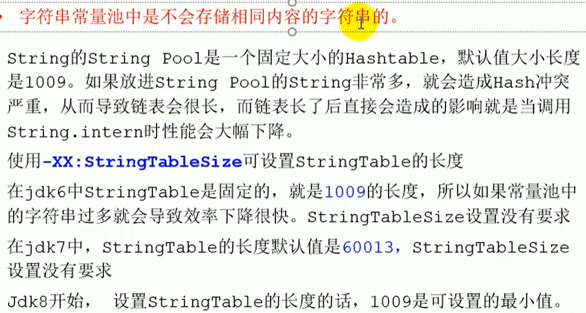
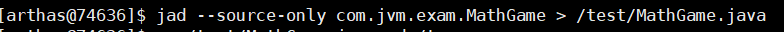

# JVM学习笔记

## 1.ClassFileFormat

### 1.1.编译字节码

使用sublime打开我们的 TestClass.class文件

```hex
cafe babe 0000 0034 0016 0a00 0400 1209
0003 0013 0700 1407 0015 0100 016d 0100
0149 0100 063c 696e 6974 3e01 0003 2829
5601 0004 436f 6465 0100 0f4c 696e 654e
756d 6265 7254 6162 6c65 0100 124c 6f63
616c 5661 7269 6162 6c65 5461 626c 6501
0004 7468 6973 0100 234c 636f 6d2f 6a76
6d2f 636c 6173 7346 696c 6546 6f72 6d61
742f 5465 7374 436c 6173 733b 0100 0369
6e63 0100 0328 2949 0100 0a53 6f75 7263
6546 696c 6501 000e 5465 7374 436c 6173
732e 6a61 7661 0c00 0700 080c 0005 0006
0100 2163 6f6d 2f6a 766d 2f63 6c61 7373
4669 6c65 466f 726d 6174 2f54 6573 7443
6c61 7373 0100 106a 6176 612f 6c61 6e67
2f4f 626a 6563 7400 2100 0300 0400 0000
0100 0200 0500 0600 0000 0200 0100 0700
0800 0100 0900 0000 2f00 0100 0100 0000
052a b700 01b1 0000 0002 000a 0000 0006
0001 0000 0007 000b 0000 000c 0001 0000
0005 000c 000d 0000 0001 000e 000f 0001
0009 0000 0031 0002 0001 0000 0007 2ab4
0002 0460 ac00 0000 0200 0a00 0000 0600
0100 0000 0c00 0b00 0000 0c00 0100 0000
0700 0c00 0d00 0000 0100 1000 0000 0200
11
```

### 1.2.分析字节码

1. 使用Javap -verbose TestClass.class 编译出字节码内容

   ```java
     Last modified 2021-6-6; size 401 bytes
     MD5 checksum 93646e9c979da4d18206ab4dc0a68f2c
     Compiled from "TestClass.java"
   public class com.jvm.classFileFormat.TestClass
     minor version: 0
     major version: 52
     flags: ACC_PUBLIC, ACC_SUPER
   Constant pool:
      #1 = Methodref          #4.#18         // java/lang/Object."<init>":()V
      #2 = Fieldref           #3.#19         // com/jvm/classFileFormat/TestClass.m:I
      #3 = Class              #20            // com/jvm/classFileFormat/TestClass
      #4 = Class              #21            // java/lang/Object
      #5 = Utf8               m
      #6 = Utf8               I
      #7 = Utf8               <init>
      #8 = Utf8               ()V
      #9 = Utf8               Code
     #10 = Utf8               LineNumberTable
     #11 = Utf8               LocalVariableTable
     #12 = Utf8               this
     #13 = Utf8               Lcom/jvm/classFileFormat/TestClass;
     #14 = Utf8               inc
     #15 = Utf8               ()I
     #16 = Utf8               SourceFile
     #17 = Utf8               TestClass.java
     #18 = NameAndType        #7:#8          // "<init>":()V
     #19 = NameAndType        #5:#6          // m:I
     #20 = Utf8               com/jvm/classFileFormat/TestClass
     #21 = Utf8               java/lang/Object
   {
     public com.jvm.classFileFormat.TestClass();
       descriptor: ()V
       flags: ACC_PUBLIC
       Code:
         stack=1, locals=1, args_size=1
            0: aload_0
            1: invokespecial #1                  // Method java/lang/Object."<init>":()V
            4: return
         LineNumberTable:
           line 7: 0
         LocalVariableTable:
           Start  Length  Slot  Name   Signature
               0       5     0  this   Lcom/jvm/classFileFormat/TestClass;
   
     public int inc();
       descriptor: ()I
       flags: ACC_PUBLIC
       Code:
         stack=2, locals=1, args_size=1
            0: aload_0
            1: getfield      #2                  // Field m:I
            4: iconst_1
            5: iadd
            6: ireturn
         LineNumberTable:
           line 12: 0
         LocalVariableTable:
           Start  Length  Slot  Name   Signature
               0       7     0  this   Lcom/jvm/classFileFormat/TestClass;
   }
   SourceFile: "TestClass.java"
   ```

2. 使用idea插件打开

### 1.3.class文件的结构

#### 1.31.基本的数据类型:

1. 无符号数

   | 类型      | u1   | u2   | u4   | u8   |
   | --------- | ---- | ---- | ---- | ---- |
   | 大小/字节 | 1    | 2    | 4    | 8    |

2. "_info"结尾的表

#### 1.32.十六进制的字节码分别代表:

1. 魔数(Magic Number) 4字节
2. 版本号(Major Version) 4字节  ->52.0  次版本号(.0)+主版本号(52)
3. 常量池(Constant Pool) 
4. 访问标志(access_flags) 2字节
5. 等等...
6. 

## 2.JMM

### 2.1.一致性

- 总线锁(早期)

- MESI协议 https://www.cnblogs.com/z00377750/p/9180644.html

>Core0修改v后，发送一个信号，将Core1缓存的v标记为失效，并将修改值写回内存。
>
>Core0可能会多次修改v，每次修改都只发送一个信号（发信号时会锁住缓存间的总线），Core1缓存的v保持着失效标记。
>
>Core1使用v前，发现缓存中的v已经失效了，得知v已经被修改了，于是重新从其他缓存或内存中加载v。


### 2.2.乱序

- 硬件解决乱序的两种方式:

>1.内存屏障 X86
>
>sfence:  store| 在sfence指令前的写操作当必须在sfence指令后的写操作前完成。
>lfence：load | 在lfence指令前的读操作当必须在lfence指令后的读操作前完成。
>mfence：modify/mix | 在mfence指令前的读写操作当必须在mfence指令后的读写操作前完成。
>
>2.原子指令,lock等操作

- JVM级别如何规范（JSR133）

> LoadLoad屏障：
> 	对于这样的语句Load1; LoadLoad; Load2， 
>
> 	在Load2及后续读取操作要读取的数据被访问前，保证Load1要读取的数据被读取完毕。
>
> StoreStore屏障：
>
> 	对于这样的语句Store1; StoreStore; Store2，
> 							
> 	在Store2及后续写入操作执行前，保证Store1的写入操作对其它处理器可见。
>
> LoadStore屏障：
>
> 	对于这样的语句Load1; LoadStore; Store2，
> 							
> 	在Store2及后续写入操作被刷出前，保证Load1要读取的数据被读取完毕。
>
> StoreLoad屏障：
>
> ```
> 对于这样的语句Store1; StoreLoad; Load2，
> 
> 在Load2及后续所有读取操作执行前，保证Store1的写入对所有处理器可见。
> ```

### 2.3.volatile的实现细节

1. 字节码层面
   ACC_VOLATILE

2. JVM层面
   volatile内存区的读写 都加屏障

   > StoreStoreBarrier                             前面的写
   >
   > volatile 写操作                 ====>     volatile 写
   >
   > StoreLoadBarrier                             后面的读

   > LoadLoadBarrier                            前面的读
   >
   > volatile 读操作                 ====>    volatile 读
   >
   > LoadStoreBarrier                            后面的写

3. OS和硬件层面
   https://blog.csdn.net/qq_26222859/article/details/52235930
   hsdis - HotSpot Dis Assembler
   windows lock 指令实现 | MESI实现

### 2.4.synchronized实现细节

1. 字节码层面
   ACC_SYNCHRONIZED
   monitorenter monitorexit
2. JVM层面
   C C++ 调用了操作系统提供的同步机制
3. OS和硬件层面
   X86 : lock cmpxchg
   [https](https://blog.csdn.net/21aspnet/article/details/88571740)[://blog.csdn.net/21aspnet/article/details/](https://blog.csdn.net/21aspnet/article/details/88571740)[88571740](https://blog.csdn.net/21aspnet/article/details/88571740)

## 3.对象创建过程

P48

1. class loading(类加载到内存)
2. class linking(类连接)
   1. verification(验证)
   2. preparation(静态变量给默认值)
   3. resolution(解析)
3. <clinit>(class initializing)(静态变量初始值,静态语句块)
4. 申请对象内存(指针碰撞,空闲列表,CAS,TLAB)
5. 成员变量赋默认值
6. 调用构造方法
   1. 成员变量,成员代码块
   2. 构造方法的方法体

## 4.对象在内存中的存储布局

**普通对象**(new Object() 16字节)

1. 对象头 markword 8字节

2. ClassPointer指针(指向Class对象的指针)   -XX:+UseCompressedClassPointers 为4字节 不开启为8字节

3. 实例数据(8大基本数据类型大小,引用数据类型 -XX:+UseCompressedOops 为4字节 不开启为8字节 ) 

4. padding 对齐(保证对象的总大小为8的倍数)

   上面的参数用java -XX:+PrintCommandLineFlags -version 观察虚拟机的配置

   

**数组对象**(new int[]{} 16字节)

比普通对象多一个数组的长度length 4字节

### 4.1.对象的创建过程和内存布局

[测试代码](src/main/java/com/jvm/object/CustomerTest.java)


### 4.2.对象的访问定位

p52

## 5.对象头信息(markword)

p 482


[测试代码](src/main/java/com/jvm/hashCode/TestSyncHashCode.java)


## 6.垃圾确认算法

### 6.1.Reference Counting(引用计数算法) 

>在对象中添加一个引用计数器,每当有一个地方引用它,计数器值就加一,当引用失效时,计数器的值就减一.任何时刻计数器为零的对象就是垃圾

```
缺点:循环引用对象无法被确认为垃圾
```

### 6.2.Root Seraching(可达性分析算法)

>通过一系列的"GC Roots"的根对象作为起始节点集,从这些节点开始,根据引用关系向下搜索,搜索过程所走的路径称为"引用链"(Reference Chain),如果某个对象到GC Roots间没有任何引用链相连,则这个对象是垃圾

GC Roots包括:

- JVM stack中引用的对象(栈帧中函数的参数,局部变量,临时变量)
- 方法区中的类静态属性引用的对象(Java类的引用类型静态变量 static Person person)
- 方法区中常量引用的对象(字符串常量池)
- 本地方法Native引用的对象
- 虚拟机内部的引用(Class对象,异常对象,系统类加载器)
- synchronized持有的对象
- **对于部分区域收集的时候,需要回收的区域的对象还可能被不需回收区域的对象引用,不需回收区域的这些对象也是GC Roots,例如Minor GC,Major GC,Mixed GC**(卡表的一个元素对应一个卡页，只要卡页有一个以上的对象存在跨代指针，整个卡页加入GC roots（卡表的一个元素）；p85解决卡表的2个问题)

### 6.3.Card Table

>由于YGC的时候,某些由root对象可达的对象指向了OLD区,由于Root Searching算法导致我们可能遍历整个OLD区,来找到我们Y区存活的对象
>
>由此,诞生卡表Card Table,如果一个OLD区中有任何一个对象指向Y区，就将该对象位于的卡页对应的卡表的数组元素置1,即变Dirty，下次扫描时，只需要扫描Dirty Card的卡页
>
>BitMap:用位来记录卡表的每个卡页的状况

## 7.垃圾回收算法

标记（三色指针）p87  **增量更新（CMS），原始快照(G1,Shenandoah)**

### 7.1.标记-清除算法

>采用Root Searching对所有的GC Root标记,被标记了的就是不需要回收的对象,标记完成后,统一回收没有被标记的对象。（**标记所有需要回收的对象,标记完成后,统一回收所有被标记的对象，周志明书上说，有疑问**）

```
优点: 存活对象比较少的情况下，标记存活的对象，效率高
缺点: 需要扫描2次,执行效率不稳定,容易产生碎片,stw（安全点，安全区域p82）
```

### 7.2.标记-复制算法(Survivor)

>将内存分为大小相等的两块,每次只使用其中的一块,当这一块的内存用完了,就将还存活着的对象复制到另一块没有用的内存块上,然后回收使用过的这块内存的对象（空间换时间）

```
优点: 使用存活对象较少的情况,只需扫描一次,效率提高,没有碎片
缺点: 内存减半空间浪费,移动复制对象,需要调整对象的引用
```

### 7.3.标记-整理算法(老年代)

>让所有存活的对象都向内存空间的一端移动,然后回收边界以外另一端的内存

```
优点: 较于标记清除非移动式算法,空间连续,提升内存访问效率,提高程序吞吐量
缺点: 需要扫描2次,移动对象需要修改对象的引用，stw(安全点，安全区域p82)
```


## 8.垃圾收集器


**收集器的并行和并发**

- 并行：多个垃圾收集器线程工作，用户线程等待
- 并发：多个垃圾收集器线程和多个用户线程同时工作

### 8.1.Serial

```
串行回收；
标记复制算法；
用于单核处理器的机器上，没有线程交互的开销，单线程收集效率最高
用在客户端
```

### 8.2.Serial Old

```
串行回收；
标记整理算法；
主要用在客户端
用在服务端作用：1.JDK5以及之前和Parallel Scavenge搭配使用
			  2.CMS的后备方案，CMS的并发收集发生Concurrent Mode Failure失败（p97）时使用
```

### 8.3.ParNew

```
并行回收；
标记复制算法；
主要用在服务端；
除了Serial就ParNew可以和CMS搭配，Parallel Scavenge不能和CMS搭配原因：p92页脚
```

### 8.4.Parallel Scavenge

```
并行回收；吞吐量优先 (最大垃圾收集停顿时间，吞吐量大小，垃圾收集的自适应调节策略)p94的三个参数
标记复制算法；
主要用在服务端，不需要太多交互任务的场景，如执行批量处理，订单处理，工资支付，科学计算
```

### 8.5.Parallel Old

```
 并行回收；
 标记整理算法；
 主要用在服务端
 搭配 Parallel Scavenge 实现真正的吞吐量优先，避免Parallel Scavenge+Serial Old，Serial Old拖后腿
```

### 8.6.CMS


```
标记清除算法；
卡表(跨代引用)
三色标记,增量更新(并发标记)
主要用于服务端，低停顿（低stw）
四大过程 p96,三个缺点 p97
```

**总结：**


### 8.7.Garbage First(G1)

>关键数据结构:
>
>1. RSet(Remember Set) : 替代前面垃圾回收器用来解决跨代引用的Card Table卡表的
>
>      ```
>      RSet:每个Region都有一个RSet,它记录了其他Region中的对象到本Region的引用
>      优点:使得垃圾回收器不需要扫描整个堆来找到谁引用了当前分区中的对象,只需要扫描RSet,没有别的引用指向当前Region,当前Region就是垃圾
>      	配合STAB效率贼高,比增量更新对象变为灰色可能要重新扫描贼多对象效率更高
>      缺点:耗费更多的内存,当新的引用诞生时要更新RSet(写屏障解决-->非内存屏障)
>      ```
>
>

p 98

```
跨代引用(RSet) 
整体标记整理，Region之间标记复制 
Region ； 优先级列表
三色标记,STAB(并发标记);
四大过程；
低stw和高吞吐兼得，6G到8G内存以上的大内存机器G1比CMS表现更好
缺点： 卡表多，内存占用大，20%的堆空间
```

### 8.8.Shenandoah

p 105

```
和G1相似的内存布局；
STAB(并发标记);
9大步骤；
G1的筛选回收只能并行，Shenandoah可以并发回收（卡表->连接矩阵，对象头上多一个转发指针，CAS保证并发访问，读写屏障拦截）
```

书上不清晰的图：


### 8.9.ZGC

p112

```
Region动态大小，支持动态创建、销毁；
解决跨代引用:染色指针来代替G1的RSet,前面几个垃圾回收器的卡表;
只能linux;
虚拟内存到物理内存多重映射
4大步骤
```

### 8.10.常见垃圾回收器组合参数设定：(1.8)

-XX:+UseSerialGC = Serial New (DefNew) + Serial Old

>小型程序。默认情况下不会是这种选项，HotSpot会根据计算及配置和JDK版本自动选择收集器

-XX:+UseParNewGC = ParNew + SerialOld

>这个组合已经很少用（在某些版本中已经废弃）[链接](https://stackoverflow.com/questions/34962257/why-remove-support-for-parnewserialold-anddefnewcms-in-the-future)

-XX:+UseConc(urrent)MarkSweepGC = ParNew + CMS + Serial Old

>CMS

-XX:+UseParallelGC = Parallel Scavenge + Parallel Old (1.8默认)

>JDK8的默认

-XX:+UseG1GC = G1

>G1

## 9.HotSpot(what is ?)

hotspot指的是热点代码探测技术

1. 通过**计数器找到最具编译价值的代码**,触发及时编译或栈上替换
2. 通过编译器与解释器协调工作,在程序最优化的响应时间与最佳性能中取得平衡

## 10.JVM整体详细模型


## 11.类加载子系统

### 11.1.类加载大致过程


### 11.2.类加载的几大步骤


注意:初始化的阶段,一个类只能<clinit>()一次,多个线程的情况下会被同步加锁

[示例代码](src/main/java/com/jvm/clinit/TestSyncClinit.java)

### 11.3.Loading的类加载器


类加载器之间的等级关系

```java
public class ClassLoaderLevel {
    public static void main(String[] args) {
        // BootStrapClassLoader是C++写的,java类库没有与之对应的类,返回为null
        System.out.println(String.class.getClassLoader());           // null
        System.out.println(sun.awt.HKSCS.class.getClassLoader());    //null
        // ExtClassLoader
        System.out.println(sun.net.spi.nameservice.dns.DNSNameService.class.getClassLoader());
        // AppClassLoader
        System.out.println(ClassLoaderLevel.class.getClassLoader());

        // ExtClassLoader是被BootStrapClassLoader加载的
        System.out.println(sun.net.spi.nameservice.dns.DNSNameService.class.getClassLoader().getClass().getClassLoader());
        // AppClassLoader是被BootStrapClassLoader加载的
        System.out.println(ClassLoaderLevel.class.getClassLoader().getClass().getClassLoader());

        // 自定义ClassLoader的父加载器AppClassLoader
        System.out.println(new MSBClassLoader().getParent());
        // 系统加载器是AppClassLoader
        System.out.println(ClassLoader.getSystemClassLoader());
    }
}
```

每个类加载器能加载的路径

> 从Launcher的源码发现
>
> 
>
> 
>
> 

[测试代码](src/main/java/com/jvm/classLoader/ClassLoaderScope.java)

### 11.4.双亲委派机制过程

> 
>
> [验证 代码](src/main/java/com/jvm/parentAppoint/StringTest.java)

> 使用ClassLoader
>
> ```java
> // 主要的loadClass方法
> Class clazz = LoadClassByHand.class.getClassLoader().loadClass("com.jvm.TestClass");
> System.out.println(clazz.getName());
> ```


> ClassLoader源码:

```java
 protected Class<?> loadClass(String name, boolean resolve)
        throws ClassNotFoundException
    {
        synchronized (getClassLoadingLock(name)) {
            // First, check if the class has already been loaded
            // find in cache
            Class<?> c = findLoadedClass(name);
            // cache没有
            if (c == null) {
                long t0 = System.nanoTime();
                try {
                    if (parent != null) {
                        // ClassLoader的构造方法已经把我们自定义的加载器父加载器赋值了
                        // 递归找父加载器
                        c = parent.loadClass(name, false);
                    } else {
                        // 交给Bootstrap加载器加载
                        c = findBootstrapClassOrNull(name);
                    }
                } catch (ClassNotFoundException e) {
                    // ClassNotFoundException thrown if class not found
                    // from the non-null parent class loader
                }

                // 递归的上层万一返回还是空,下层亲自加载
                if (c == null) {
                    // If still not found, then invoke findClass in order
                    // to find the class.
                    long t1 = System.nanoTime();
                    // 自定义ClassLoader重写这个方法
                    c = findClass(name);

                    // this is the defining class loader; record the stats
                    sun.misc.PerfCounter.getParentDelegationTime().addTime(t1 - t0);
                    sun.misc.PerfCounter.getFindClassTime().addElapsedTimeFrom(t1);
                    sun.misc.PerfCounter.getFindClasses().increment();
                }
            }
            if (resolve) {
                resolveClass(c);
            }
            return c;
        }
    }
```

> JDK的双亲委派是**模板方法**模式,我们自定义类加载器只要:
>
> ​		**继承ClassLoader,重写findClass,来自定义类加载器**
>
> [自定义类加载器代码](src/main/java/com/jvm/classLoader/MyClassLoader.java)
>
> [自定义加密类加载器代码](src/main/java/com/jvm/classLoader/ClassLoaderWithEncryption.java)
>
> 被加载的class文件位置
>
> 

.png)

### 11.5.双亲委派机制好处

>1. 安全,避免核心API被替换
>
>   ```
>   例:写一个假的java.lang.String,里面包括获取用户密码的操作,打包发布,被别的公司当初第三方依赖使用,它的用户密码就会被盗取
>   ```
>
>2. 避免类的重复加载

[验证代码](src/main/java/java/lang/String.java)

[验证代码](src/main/java/java/lang/Test.java)

### 11.6.JVM中两个类是否为同一个类

>条件:
>
>1. 包名,类名一样
>2. 类加载器一样

### 11.7.双亲委派的打破

1. 如何打破：重写loadClass（）

2. 何时打破过？

   - JDK1.2之前，自定义ClassLoader都必须重写loadClass()

   - ThreadContextClassLoader可以实现基础类调用实现类代码，通过thread.setContextClassLoader指定

   - 热启动，热部署

     >osgi tomcat 都有自己的模块指定classloader（可以加载同一类库的不同版本）
     >
     >[由于双亲委派无法热加载](src/main/java/com/jvm/hotLoading/ClassReloading1.java)
     >
     >[打破双亲委派实现热加载](src/main/java/com/jvm/hotLoading/ClassReloading2.java)

## 12.六种情况类需要对类Initialization初始化

1. 四个指令(测试代码)

   >- new   测试代码
   >- getstatic  读静态字段
   >- putstatic  写静态字段
   >- invokestatic  调静态方法

2. 反射

3. 初始化子类,父类要在子类之前初始化

4. 执行main之前,先初始化包含main方法的主类

5.  实现类实现了带有default方法的接口,实现类初始化之前,接口先初始化

6. 当使用JDK 1.7的动态语言支持时，如果一个java.lang.invoke.MethodHandle实例最后的解析结果REF_getStatic、REF_putStatic、REF_invokeStatic的方法句柄，并且这个方法句柄所对应的类没有进行过初始化，则需要先触发其初始化

[代码验证](src/main/java/com/jvm/lazyLoading/LazyLoading.java)

## 13.运行时数据区(Runtime Data Areas )


### 13.1.PC寄存器

>作用:用来存储下一条指令的地址(**线程私有**)

```
pc寄存器存储字节码指令地址作用:
	答:cpu会不断的切换各个线程,切换回来就得知道接着从哪开始执行,pc寄存器里面放的地址就是
```

### 13.2.虚拟机栈

>what : 每个线程创建时都会创建一个虚拟机栈,其内部保存一个个的栈帧,对应者一次次的java方法的调用,一个栈帧对应一个Java方法(**线程私有**)
>
>作用: 保存**方法的局部变量**,部分结果,**参与方法的调用和返回**

[StackOverflowError](src/main/java/com/jvm/oom/TestStackOverflowError.java)

[StackOutOfMemory](src/main/java/com/jvm/oom/TestStackOutOfMemory.java)


#### 13.3.栈帧的内部结构


#### 13.3.1.局部变量表

>数字数组,存储**方法参数**,和定义在**方法体内的局部变量**,以及**返回值类型**


##### 13.3.1.1.变量槽(Slot)

>局部变量表就是用slot组成的数组,4个字节,long和double占2个slot,其他均只占一个

**slot重复利用**


[测试代码](src/main/java/com/jvm/SlotTest.java)

#### 13.3.2.操作数栈


一个操作数栈的单位为4字节,8字节的数据占两个单位

#### 13.3.3.一个栈帧运行过程

1. 源代码和字节码

   

2. 执行引擎执行

   


#### 13.3.4.动态链接

>指向运行时常量池的方法引用 
>
>


#### 13.3.5.静态和动态链接

> 静态链接:目标方法在编译期间就可知,且运行期间保持不变,这种情况下,将调用方法的符号引用转换为直接引用就叫静态链接
>
> invokestatic, invokespecial, 

>动态链接:被调用的方法在编译期间无法确定,只有在运行期间将调用方法的符号引用转换为直接引用(多态)
>
>invokevirtual,invokeinterface


[测试代码](src/main/java/com/jvm/Invoke/Son.java)

#### 13.3.6.invokedynamic指令

invokedynamic对于动态语言的支持,让java有了动态语言的特性,主要体现lambda,反射,Cglib,ASM


[测试代码](src/main/java/com/jvm/Invoke/Lambda.java)

#### 13.3.7.方法重写的本质

> 1. 找到操作数栈顶的第一个元素所执行的对象的实际类型，记作C。
> 2. 如果在类型C中找到与常量中的描述符号简单名称都相符的方法，则进行访问权限校验，如果通过则返回这个方法的直接引用，查找过程结束；如果不通过，则返回java.lang.IllegalAccessError异常。
> 3. 否则，按照继承关系从下往上依次对C的各个父类进行第2步的搜索和验证过程。
> 4. 如果始终没有找到合适的方法，则抛出java.lang.AbstractMethodError异常。

IllegalAccessError：

程序试图访问或修改一个属性或调用一个方法，这个属性或方法，你没有权限访问。一般的这个会引擎编译器异常，这个错误如果发生在运行时，就说明一个类发生了不兼容的改变。

为了提高效率,jvm在类加载的init阶段会预处理,创建一个虚方法表,存放各个方法的实际入口

#### 13.3.8.方法返回地址

>正常退出,返回主调方法的PC计数器的值
>
>异常退出,不返回任何值(交给异常处理表确定)

对于有返回值的return指令不一样

[测试代码](src/main/java/com/jvm/returns/ReturnAddressTest.java)

主调方法在接到被调方法返回的PC计数器的值4,**但是5是什么时候压入到m2的操作数栈顶书上没说明白**


#### 13.3.9.附加信息

>可能带有调试,性能收集信息

### 13.4本地方法栈

>专为本地方法native服务,其他和虚拟机栈一样,hotspot将本地方法栈和虚拟机栈合二为一,虚拟机栈直接可以调native方法

### 13.5.堆


[默认占物理内存大小代码](src/main/java/com/jvm/heap/HeapSpaceInitial.java)

#### 13.5.1各类OOM

1. [堆空间OOM](src/main/java/com/jvm/oom/TestHeapOOM.java)
2. [栈空间OOM](src/main/java/com/jvm/oom/TestStackOutOfMemory.java)
3. [栈溢出](src/main/java/com/jvm/oom/TestStackOverflowError.java)
4. [字符串常量池OOM](src/main/java/com/jvm/oom/StringConstantPoolOOM.java)
5. [元空间OOM](src/main/java/com/jvm/oom/MetaspaceOOM.java)
6. [直接内存OOM](src/main/java/com/jvm/oom/DirectMemoryOOM.java)

#### 13.5.2.堆的分代比例设置

>在没有显式的设置`-XX:SurvivorRatio`=8的时候发现Eden:Survivor0=6,官方说开启了-XX:+UseAdaptiveSizePolicy自适应大小调整
>
>官方原话:
>
>如果禁用了自适应大小调整（使用该`-XX:-UseAdaptiveSizePolicy`选项），`-XX:SurvivorRatio`则应使用该选项为整个应用程序执行设置幸存者空间的大小。

[代码](src/main/java/com/jvm/memorySize/EdenSurvivorTest.java)

#### 13.5.3.对象在内存中的分配过程


#### 13.5.3.几种GC

1. 部分收集

   1. 只回收年轻代 (Minor GC / YGC) : 当Eden区满触发,Survivor区满不会触发Minor GC
   2. 只回收老年代(Major GC / Old GC) : **CMS收集器独有**
   3. 新生代+部分老年代(Mixed GC) : **G1收集器独有**

2. 整堆收集(Full Gc)

   >触发条件: 
   >
   >1. 老年代满
   >2. 方法区满
   >3. 调用System.gc() 
   >4. Minor GC 导致survivor装不下,触发空间分配担保,但是失败了:<u>**老年代连续空间小于新生代对象总大小**</u>  或  <u>**老年代连续空间小于历次晋升的平均大小**</u>

#### 13.5.5.动态年龄判定

>在HotSpot中,如果Survivor空间中相同年龄所有对象大小的总和大于一个Survivor空间的一半,年龄大于或等于该年龄的对象直接进入老年代,没有年龄限制

#### 13.5.6.堆空间常用参数

```
 * -XX:+PrintFlagsInitial : 查看所有的参数的默认初始值
 * -XX:+PrintFlagsFinal  ：查看所有的参数的最终值（可能会存在修改，不再是初始值）
 *      具体查看某个参数的指令： jps：查看当前运行中的进程
 *                             jinfo -flag SurvivorRatio 进程id
 *
 * -Xms：初始堆空间内存 （默认为物理内存的1/64）
 * -Xmx：最大堆空间内存（默认为物理内存的1/4）
 * -Xmn：设置新生代的大小。(初始值及最大值)
 * -XX:NewRatio：配置新生代与老年代在堆结构的占比
 * -XX:SurvivorRatio：设置新生代中Eden和S0/S1空间的比例
 * -XX:MaxTenuringThreshold：设置新生代垃圾的最大年龄
 * -XX:+PrintGCDetails：输出详细的GC处理日志
 * 打印gc简要信息：① -XX:+PrintGC   ② -verbose:gc
 * -XX:HandlePromotionFailure：是否设置空间分配担保
```

### 13.6.逃逸分析

>分析对象动态作用域,当一个对象在方法里面被定义后,它可能被外部方法所引用,例如:
>
>1. 方法逃逸:对象作为调用参数传递到其他方法中
>2. 线程逃逸:对象赋值给可以在其他线程中访问的实例变量(如**给成员变量赋值**)

### 13.7.栈上分配

>**允许方法逃逸,但是不允许线程逃逸**

[测试代码](src/main/java/com/jvm/escapeAnalysis/StackAllocation.java)

### 13.8.同步消除

>被锁的对象**没有线程逃逸**,可以锁消除

[测试代码(有困惑)](src/main/java/com/jvm/escapeAnalysis/SyncElimination.java)

### 13.9.标量替换

>对于未发生**方法逃逸**的对象,在程序真正运行的时候可能**不去创建这个对象**,而改为直接**在栈上创建它的若干个被这个方法使用的成员变量来代替**

[测试代码](src/main/java/com/jvm/escapeAnalysis/ScalarReplace.java)

### 13.10.方法区

JVM **规范** : 方法区包括:(**Class信息,常量池,静态变量,即时编译的代码缓存**)

>**hotspot**
>
>JDK6 实现 : 永久代(Class信息+运行时常量池+字符串常量池+静态变量+即时编译的代码缓存) **(jvm虚拟内存**,不会触发FGC不回收)
>
>JDK7 实现 : 字符串常量池(**堆中**)  +  静态变量(**堆中**)    +  永久代(运行时常量池+Class信息+即时编译的代码缓存)(**还是jvm虚拟内存**,不会触发FGC不回收)
>
>JDK8 实现: 字符串常量池(**堆中**)  +  静态变量(**堆中**)  +  元空间(运行时常量池+Class信息+即时编译的代码缓存)(**本地内存**,会触发FGC会回收)

```
永久代为什么会被元空间代替?
答: 1.为永久代设置空间大小很难确定,在某些场景下,如果动态加载类过多,容易产生永久代的OOM.而元空间使用本地内存,默认只受本地内存限制
	2.对永久代垃圾回收很困难(回收常量相对简单,但回收一个类型Class的判断非常复杂-P74,会把FGC变得复杂)
```

```
为什么字符串常量池移到堆中?
答:  1.String.intern()方法的效率提升,节省了复制堆中的字符串到常量池中的成本  P61
	 2.堆内存比较大,不容易OOM
	 3.堆外的方法区(FGC)的内存回收效率(可回收比例和执行时间成本)不如堆内(YGC+FGC)
```

## 14.执行引擎


### 14.1.解释器(Interpreter)

>当java虚拟机启动时会根据定义的规范**对字节码采用逐行解释**的方式执行,将每条字节码文件中的内容"解释"为对应平台的**本地机器指令**执行

### 14.2.编译器(JIT)

>即时编译器:**将源代码直接编译成和本地机器平台相关的机器指令**

```
既然HotSpot中已经内置了JIT即时编译器,为什么还要解释器来"拖累"程序的执行性能?
答: 程序启动后,解释器能马上发挥作用,省去编译的时间,立即执行.(IOS的客户端程序响应速度快的原因) 但是编译器要想发挥作用,得把代码编译成本地代码,需要一定的执行时间,编译完成后,执行效率高(对于启动时间不重要的服务端很适合)
```

#### 14.2.1.JIT的触发


##### 14.2.1.1.方法调用计时器


###### 14.2.1.2.热度衰减


##### 14.2.1.2.回边计数器


##### 14.2.1.3.JIT的分类


### 14.3.解释器与编译器的配合使用

[解释器与编译器性能代码测试](src/main/java/com/jvm/IntCompTest.java)

## 15.字符串常量池（StringTable）

### 15.1.String的不可变性

[测试代码](src/main/java/com/jvm/string/StringTest1.java)

[面试题](src/main/java/com/jvm/string/StringExer.java)

### 15.2.String常量池的字符串不重复原理



[测试代码](src/main/java/com/jvm/string/StringTest2.java)

### 15.3.字符串的拼接

[测试代码](src/test/string/StringTest5.java)

>1. 常量与常量拼接结果在常量池，原理：编译期优化
>
>  .java文件：
>
>  
>
>  .class文件
>
>  
>
>
>
>2. 拼接操作，只要有一个是变量，会创建StringBuilder来append,最终返回的对象会被创建在堆中。
>
>  
>
>  ​			
>
>

### 15.4.String::intern()

```
如果字符串常量池中已经包含一个等于此String对象的字符串，则返回代表池中这个字符串的String对象的引用（堆中对象的地址）；否则，会将此String对象包含的字符串添加到常量池中，并且返回此String对象的引用。（还是堆中）
```

>
>
>  [测试代码](src/main/java/com/jvm/string/StringTest6.java)

### 15.5.String不同写法创建对象的个数

1. ```java
   String a="aa" (如果字符串常量池有,创建:0个;没有,创建:1个(字符串常量池中));
   ```

2. ```java
   String b=new String("aa")(堆中创建一个,如果字符串常量池有,创建1+0个;没有,创建:1+1个(字符串常量池中))
   ```

### 15.6.字符串常量池的垃圾回收

[测试代码](src/main/java/com/jvm/string/StringGCTest.java)

## 16.调优实战

### 16.1.什么是调优+两个目标

- **什么是调优**:

1. 根据需求进行JVM规划和预调优

   ```
   场景 :垂直电商，最高每日百万订单，处理订单系统需要什么样的服务器配置(或要求响应时间100ms)？
   	答:  ①	1小时360000集中时间段,大约100个订单/秒，找一小时内的高峰期,大约1000订单/秒
   		 ② 	一个订单前后产生的对象最多512k,1000个订单500M内存可以解决,所以在年轻代500M然后只要他YGC及时能回收,1.5G的机器可以解决
   		 ③	当然这只是个估算,具体情况还得压测
   ```

   

2. 优化运行JVM运行环境（慢，卡顿 , 频繁GC）

   ```
   1.场景: 有一个50万PV的资料类网站（从磁盘提取文档到内存）原服务器32位，1.5G的堆，用户反馈网站比较缓慢，因此公司决定升级，新的服务器为64位，16G的堆内存，结果用户反馈卡顿十分严重，反而比以前效率更低了
   	答:
          1. 为什么原网站慢?
             很多用户浏览数据，很多数据load到内存，内存不足，频繁GC，STW长，响应时间变慢
          2. 为什么会更卡顿？
             内存越大，FGC时间越长
          3. 咋办？
             PS -> PN + CMS 或者 G1
   
   ```

   ```
   2. 场景:线程池运用不当(17.2章节)
   ```

   ```
   3. 场景:如果有一个系统，内存一直消耗不超过10%，但是观察GC日志，发现FGC总是频繁产生，会是什么引起的？
   
    答:	有人在代码显式调用System.gc();
   ```

3. 解决JVM运行过程中出现的各种问题(OOM)

   >1. tomcat http-header-size过大问题,导致OOM
   >
   >   ```properties
   >   #默认4096字节 
   >   server.max-http-header-size=10000000
   >   ```
   >
   >   在线排查步骤:
   >
   >   - ```shell
   >     #按内存占用大小从大到小排序
   >     jmap -histo 75156 | less
   >     ```
   >
   >   - 发现关于Http对象数量不多,但占用的内存很大
   >
   >   - 排查发现每来一个请求都创建一个Http11OutputBuffer,贼大
   >
   >   - 最后修改上面的http请求头的大小解决问题
   >
   >2. lambda表达式导致方法区溢出问题,[代码链接](src/main/java/com/jvm/exam/LambdaGC.java)
   >
   >   >每个lambda表达式的创建,都会有一个Class对象,class信息放在元空间,导致OOM
   >
   >3. 直接内存溢出问题（少见）
   >
   >   > 《深入理解Java虚拟机》P59，使用Unsafe分配直接内存，或者使用NIO的问题
   >
   >4. 栈溢出问题
   >
   >   > -Xss设定太小

- **两个目标**:

所谓调优，首先确定，追求啥？吞吐量优先，还是响应时间优先？还是在满足一定的响应时间的情况下，要求达到多大的吞吐量...

1. 吞吐量：用户线程执行时间/(用户线程执行时间+垃圾回收线程)
2. 响应时间：STW越短，响应时间越好

>吞吐量优先：科学计算，吞吐量，数据挖掘（PS + PO）
>
>响应时间优先：网站 GUI API （parNew+CMS 或1.8 G1）

### 16.2.调优步骤

 1. 熟悉业务场景（没有最好的垃圾回收器，只有最合适的垃圾回收器）
     1. 响应时间、停顿时间 [CMS G1 ZGC] （需要给用户作响应）
     2. 吞吐量 = 用户时间 /( 用户时间 + GC时间) [PS]

  2. 选择回收器组合

  3. 计算内存需求（经验值 1.5G 16G）

  4. 选定CPU（越高越好）

  5. 设定年代大小、升级年龄

  6. 设定日志参数

     1. 设参数

        ```shell
        # 5个日志文件,每个20m,5个都满了,再回去覆盖第一个,第二个,以此类推,循环
        -Xloggc:/opt/xxx/lo gs/xxx-xxx-gc-%t.log -XX:+UseGCLogFileRotation -XX:NumberOfGCLogFiles=5 -XX:GCLogFileSize=20M 
        -XX:+PrintGCDetails -XX:+PrintGCDateStamps -XX:+PrintGCCause
        ```

     2. 或者每天产生一个日志文件

  7. 观察日志情况

### 16.3.hotspot参数分类

>标准： - 开头，所有的HotSpot都支持
>
>非标准：-X 开头，特定版本HotSpot支持特定命令
>
>不稳定：-XX 开头，下个版本可能取消

#### 16.3.1.常用参数

* -Xmn -Xms -Xmx -Xss

  > 年轻代 最小堆 最大堆 栈空间

* -XX:+UseTLAB

  > 使用TLAB，默认打开

* -XX:+PrintTLAB

  > 打印TLAB的使用情况

* -XX:TLABSize

  > 设置TLAB大小

* -XX:+DisableExplictGC

  > System.gc()不管用 ，FGC

* -XX:+PrintGC

* -XX:+PrintGCDetails

* -XX:+PrintHeapAtGC

* -XX:+PrintGCTimeStamps

* -XX:+PrintGCApplicationConcurrentTime (低)

  > 打印应用程序时间

* -XX:+PrintGCApplicationStoppedTime （低）

  > 打印暂停时长

* -XX:+PrintReferenceGC （重要性低）

  > 记录回收了多少种不同引用类型的引用

* -verbose:class

  > 类加载详细过程

* -XX:+PrintVMOptions

* -XX:+PrintAssembly

  >打印反汇编

* -XX:+PrintFlagsFinal  -XX:+PrintFlagsInitial

  ```shell
  # 查CMS有关的参数默认值
  java -XX:+PrintFlagsFinal -version | grep CMS
  ```

* -Xloggc:opt/log/gc.log

* -XX:MaxTenuringThreshold

  > 升代年龄，最大值15

* 锁自旋次数 -XX:PreBlockSpin(CMS默认6,其他10)  ;热点代码检测参数-XX:CompileThreshold  ;逃逸分析-XX:+DoEscapeAnalysis  ;标量替换 -XX:+EliminateAllocations
  这些不建议设置

#### 16.3.2.Parallel常用参数

* -XX:SurvivorRatio

  >Eden:Survivor=8:1

* -XX:PreTenureSizeThreshold

  > 大对象到底多大

* -XX:MaxTenuringThreshold>

  >对象年龄 15

* -XX:+ParallelGCThreads

  > 并行收集器的线程数，同样适用于CMS，一般设为和CPU核数相同

* -XX:+UseAdaptiveSizePolicy

  > 自动选择各区大小比例

#### 16.3.3.CMS常用参数

* -XX:+UseConcMarkSweepGC

  >用CMS

* -XX:ParallelCMSThreads

  > CMS线程数量

* -XX:CMSInitiatingOccupancyFraction

  > 使用多少比例的老年代后开始CMS收集，默认是68%(近似值)，如果频繁发生SerialOld卡顿，应该调小，（频繁CMS回收）

* -XX:+UseCMSCompactAtFullCollection

  > 在FGC时进行整理

* -XX:CMSFullGCsBeforeCompaction

  > 多少次FGC之后进行整理

* -XX:+CMSClassUnloadingEnabled

  >垃圾回收会清理永久代，移除不再使用的classes

* -XX:CMSInitiatingPermOccupancyFraction

  > 达到什么比例时进行Perm回收

* GCTimeRatio

  > 设置GC时间占用程序运行时间的百分比

* -XX:MaxGCPauseMillis

  > 停顿时间，是一个建议时间，GC会尝试用各种手段达到这个时间，比如减小年轻代

#### 16.3.4.G1常用参数

* -XX:+UseG1GC

  >用G1

* -XX:MaxGCPauseMillis

  > 设置最大垃圾收集停顿时间

* -XX:GCPauseIntervalMillis

  > GC的间隔时间

* -XX:+G1HeapRegionSize

  > 分区大小，建议逐渐增大该值，1 2 4 8 16 32。
  > 随着size增加，垃圾的存活时间更长，GC间隔更长，但每次GC的时间也会更长
  > ZGC做了改进（动态区块大小）

* -XX:G1NewSizePercent

  > 新生代最小比例，默认为5%

* -XX:G1MaxNewSizePercent

  > 新生代最大比例，默认为60%

* -XX:GCTimeRatio

  > GC时间建议比例，G1会根据这个值调整堆空间

* -XX:ConcGCThreads

  > 线程数量

* -XX:InitiatingHeapOccupancyPercent

  > 启动G1的堆空间占用比例

### 16.4.面试场景题

2. 系统CPU经常100%，如何调优？**(面试高频**)

   > CPU100%那么一定有线程在占用系统资源
   >
   >    1. 找出哪个进程cpu高
   >
   >       ```shell
   >       top
   >       ```
   >
   >    2. 该进程中的哪个线程cpu高
   >
   >       ```shell
   >       top -Hp  pid
   >       ```
   >
   >    3. 找出大量占用CPU的线程的pid,并转为16进制
   >
   >       ```shell
   >       printf '%x' pid
   >       ```
   >
   >       记住对应pid的16进制值 : 6a4
   >
   >    4. 导出该线程的堆栈 
   >
   >       ```shell
   >       jstack pid > stack.txt
   >       ```
   >
   >    5. vim进入stack.txt,查找哪个类消耗大量CPU,并找到出问题代码的行数 
   >
   >       ```shell
   >        /6a4
   >       ```
   >
   >    6. 进入对应的类的源代码排除问题

3. 系统内存飙高，如何查找问题？（**面试高频**）

   >```shell
   >#生成heap.hprof快照
   >jmap -dump:live,format=b,file=heap.hprof 6268
   >#然后sz下载到本地机器使用MAT分析
   >sz heap.hprof
   >```
   >
   ><font color='red'>在线上系统，内存特别大，jmap执行期间会对进程产生很大影响，甚至卡顿（电商不适合）</font>
   >1：设定了参数-XX:+HeapDumpOnOutOfMemoryError,OOM的时候会自动产生堆转储文件
   >2：很多服务器备份（高可用），停掉这台服务器对其他服务器不影响
   >3：在线定位(一般小点儿公司用不到)
   >
   ><font color='red'>JvisualVM等图形界面分析工具不能直接连接线上系统（JMX协议），影响服务器的性能，一般只用作上线前的测试，在压测的时候观察堆内存变化</font>

## 17.真实项目调优分析问题解决步骤

### 17.1.线程池的死锁排查(linux环境)

1. [demo代码链接](src/main/java/com/jvm/exam/DeadLock.java)

2. 代码拷贝到环境中，运行代码

   

3. 结果死锁

   

4. jps查看java进程

   

5. jstack分析我们java进程的线程状态

   ```shell
   jstack pid
   ```

   

6. 发现死锁位置,修改代码

7. jstack的dump文件过长,或对于100个线程这样的多个线程怎么查找

   >1. 将jstack dump文件重定向到我们本地
   >
   >   
   >
   >2. 打开a.txt文件,找到我们的业务线程,并且状态为阻塞BLOCKED,和被我们的定义的监视器对象(锁)
   >
   >   
   >
   >3. 此时发现我们的锁对象<0x00000000f3862120>,然后Ctrl+F搜索这个值,找到线程状态为RUNNABLE的业务线程,排查这个线程的哪个代码一直占用锁,不释放,修改代码,解决死锁

### 17.2.频繁GC问题排查

1. [代码链接](src/main/java/com/jvm/exam/FGCProblem.java)

2. 代码拷贝到环境中，运行代码

   

3. 运行结果，出现YGC

   

4. 一段时间后，疯狂FGC,但每次只回收一点点

   

5. 使用top查看耗费cpu或内存的进程

   

6. 使用top -Hp pid 查看我们java进程的各个线程消耗cpu和内存情况

   

7. 使用jmap -histo 71632 | head -20 ：查看堆中对象实例个数前20的对象

   

8. 去代码排查，发现：

   - 每执行一个调度任务

     

   - scheduleWithFixedDelay里面都会new一个ScheduledFutureTask

     

   - 和日志上看到的一样，光ScheduledFutureTask就有94万多个，每循环一次modelFit都会创建一个ScheduledFutureTask被添加到任务队列里，无法回收，但是我们的线程池的拒绝策略DiscardOldestPolicy是丢弃旧任务，死循环for一直向线程池提交任务，线程池承受不了时，拒绝策略会把旧任务从任务队列丢出来，成为垃圾，每次我们FGC都会回收一些，但是只能回收一部分，日志上大约4k


## 18.使用arthas在线跟踪

><font color='red'>为什么需要在线排查？</font>
>   在生产上我们经常会碰到一些不好排查的问题，例如线程安全问题，用最简单的threaddump或者heapdump不好查到问题原因。为了排查这些问题，有时我们会临时加一些日志，比如在一些关键的函数里打印出入参，然后重新打包发布，如果打了日志还是没找到问题，继续加日志，重新打包发布。对于上线流程复杂而且审核比较严的公司，从改代码到上线需要层层的流转，会大大影响问题排查的进度。 

1. [arthas下载安装链接](https://github.com/alibaba/arthas/blob/master/README_CN.md)

2. 程序代码

   ```java
   public class MathGame {
       public static void main(String[] args) throws InterruptedException {
           MathGame game = new MathGame();
           while (true) {
               game.run();
               TimeUnit.SECONDS.sleep(1);
               // 这个不生效，因为代码一直跑在 while里
               System.out.println("in loop");
           }
       }
    
       public void run() throws InterruptedException {
           // 这个生效，因为run()函数每次都可以完整结束
           System.out.println("call run()");
       }
   ```

   

3. 把arthas程序attach到我们的上面运行的程序

   

   

4. 常规操作：[详细文档](https://arthas.aliyun.com/doc/retransform.html)

   >1.  jvm:	观察jvm信息
   >2. thread:   定位线程问题
   >3. dashboard:   观察系统情况
   >4. heapdump:  导出dump文件，可以用JvisualVM分析
   >5. jad：反编译，作用：
   >   1. 动态代理生成类的问题定位
   >   2. 第三方的类（观察代码）
   >   3. 版本问题（确定自己最新提交的版本是不是被使用）
   >6. sc : search class
   >7. dashboard: 观察系统情况
   >8. 没有包含的功能：jmap -histo 71632 | head -20 ：查看堆中对象实例个数前20的对象

5. 测试热替换

   <font color='red'>**注意正在运行的方法无法在线替换**:</font>

   

   >- 将我们的.class代码反编译成我们的.java代码,提供我们修改
   >
   >
   >
   >- 修改代码
   >
   >
   >
   >
   >
   >- mc 编译
   >
   >
   >
   >- retransform 热替换
   >
   >
   >
   >- 结果完成热替换
   >
   >
   >
   >

   


## 19.CMS日志分析

```shell
-Xms20M -Xmx20M -XX:+PrintGCDetails -XX:+UseConcMarkSweepGC
```

>```java
>[GC (Allocation Failure) [ParNew: 6144K->640K(6144K), 0.0265885 secs] 6585K->2770K(19840K), 0.0268035 secs] [Times: user=0.02 sys=0.00, real=0.02 secs] 
>// ParNew：年轻代收集器
>// 6144->640：年轻代收集前后的对比
>// （6144）：整个年轻代容量
>// 6585 -> 2770：整个堆收集前后的情况
>// （19840）：整个堆大小
>```
>
>```java
>[GC (CMS Initial Mark) [1 CMS-initial-mark: 8511K(13696K)] 9866K(19840K), 0.0040321 secs] [Times: user=0.01 sys=0.00, real=0.00 secs] 
>//1.初始标记: 8511 (13696) : 老年代使用内存（老年代最大内存） 9866 (19840) : 整个堆使用内存（堆最大内存）
>
>[CMS-concurrent-mark-start]
>[CMS-concurrent-mark: 0.018/0.018 secs] [Times: user=0.01 sys=0.00, real=0.02 secs] 
>//2.并发标记: 这里的时间意义不大，因为是并发执行
>[CMS-concurrent-preclean-start]
>[CMS-concurrent-preclean: 0.000/0.000 secs] [Times: user=0.00 sys=0.00, real=0.00 secs] 
>//3.对card marking产生的dirty card卡页进行clean，cms gc线程会扫描 dirty card对应的内存区域，更新之前记录的过时的引用信息并且去掉dirty card标记
>[GC (CMS Final Remark) [YG occupancy: 1597 K (6144 K)][Rescan (parallel) , 0.0008396 secs][weak refs processing, 0.0000138 secs][class unloading, 0.0005404 secs][scrub symbol table, 0.0006169 secs][scrub string table, 0.0004903 secs][1 CMS-remark: 8511K(13696K)] 10108K(19840K), 0.0039567 secs] [Times: user=0.00 sys=0.00, real=0.00 secs] 
>//4.重新标记	
>//STW阶段，YG occupancy:年轻代占用及容量
>//[Rescan (parallel)：STW下的存活对象标记
>//weak refs processing: 弱引用处理
>//class unloading: 卸载用不到的class,清理元空间
>//scrub symbol table: 清理元数据符号
>//scrub string table  清除字符串常量池
>//CMS-remark: 8511K(13696K): 阶段过后的老年代占用及容量  10108K(19840K): 阶段过后的堆占用及容量
>
>[CMS-concurrent-sweep-start]
>[CMS-concurrent-sweep: 0.005/0.005 secs] [Times: user=0.00 sys=0.00, real=0.01 secs] 
>//5.并发清除: 标记已经完成
>[CMS-concurrent-reset-start]
>[CMS-concurrent-reset: 0.000/0.000 secs] [Times: user=0.00 sys=0.00, real=0.00 secs]
>//6.并发重置内部结构: 为下次GC做准备
>```

## 20.G1日志分析

```shell
-Xms20M -Xmx20M -XX:+PrintGCDetails -XX:+UseG1GC
```

>```java
>[GC pause (G1 Evacuation Pause) (young) (initial-mark), 0.0015790 secs]
>//young -> 年轻代 Evacuation-> 复制存活对象到别的Region
>//initial-mark 混合回收的阶段，这里是YGC混合Old GC
>   [Parallel Time: 1.5 ms, GC Workers: 1] //一个GC线程
>      [GC Worker Start (ms):  92635.7]
>      [Ext Root Scanning (ms):  1.1]
>      [Update RS (ms):  0.0]
>         [Processed Buffers:  1]
>      [Scan RS (ms):  0.0]
>      [Code Root Scanning (ms):  0.0]
>      [Object Copy (ms):  0.1]
>      [Termination (ms):  0.0]
>         [Termination Attempts:  1]
>      [GC Worker Other (ms):  0.0]
>      [GC Worker Total (ms):  1.2]
>      [GC Worker End (ms):  92636.9]
>   [Code Root Fixup: 0.0 ms]
>   [Code Root Purge: 0.0 ms]
>   [Clear CT: 0.0 ms]
>   [Other: 0.1 ms]
>      [Choose CSet: 0.0 ms]
>      [Ref Proc: 0.0 ms]
>      [Ref Enq: 0.0 ms]
>      [Redirty Cards: 0.0 ms]
>      [Humongous Register: 0.0 ms]
>      [Humongous Reclaim: 0.0 ms]
>      [Free CSet: 0.0 ms]
>   [Eden: 0.0B(1024.0K)->0.0B(1024.0K) Survivors: 0.0B->0.0B Heap: 18.8M(20.0M)->18.8M(20.0M)]
> [Times: user=0.00 sys=0.00, real=0.00 secs] 
>//以下是混合回收其他阶段
>[GC concurrent-root-region-scan-start]
>[GC concurrent-root-region-scan-end, 0.0000078 secs]
>[GC concurrent-mark-start]
>//没有空闲的Region,无法evacuation,进行FGC
>[Full GC (Allocation Failure)  18M->18M(20M), 0.0719656 secs]
>   [Eden: 0.0B(1024.0K)->0.0B(1024.0K) Survivors: 0.0B->0.0B Heap: 18.8M(20.0M)->18.8M(20.0M)], [Metaspace: 38
>76K->3876K(1056768K)] [Times: user=0.07 sys=0.00, real=0.07 secs]
>```

## 21.PS.日志分析

[测试代码](src/main/java/com/jvm/gc/GcLog.java)


- 上面GC部分


- 下面heap dump部分：


```
eden space 5632K, 94% used [0x00000000ff980000,0x00000000ffeb3e28,0x00000000fff00000)
                               起始地址           使用空间结束地址    整体空间结束地址
```

##  22.面试必会

1. -XX:MaxTenuringThreshold控制的是什么？
   √ A: 对象升入老年代的年龄
      B: 老年代触发FGC时的内存垃圾比例

2. 生产环境中，倾向于将最大堆内存和最小堆内存设置为：（为什么？）
   √ A: 相同 B：不同

3. JDK1.8默认的垃圾回收器是：
         A: ParNew + CMS
     	B: G1
      √ C: PS + ParallelOld
     	D: 以上都不是

4. 什么是响应时间优先？

5. 什么是吞吐量优先？

6. ParNew和PS的区别是什么？

   >两者都是复制算法，都是并行处理，但是不同的是，parallel scavenge 可以设置最大gc停顿时间（-XX:MaxGCPauseMills）以及gc时间占比(-XX:GCTimeRatio)

7. ParNew和ParallelOld的区别是什么？（年代不同，算法不同）

8. 长时间计算的场景应该选择：A：停顿时间   √ B: 吞吐量

9. 大规模电商网站应该选择：√ A：停顿时间 B: 吞吐量

10. HotSpot的垃圾收集器最常用有哪些？

11. 常见的HotSpot垃圾收集器组合有哪些？

    >8.10章节

12. JDK1.7 1.8 1.9的默认垃圾回收器是什么？如何查看？

      >java -XX:+PrintCommandLineFlags -version
      >
      >1.7和1.8是PS+PO
      >
      >1.9 G1

13. 所谓调优，到底是在调什么？

      >章节 16.1

14. 如果采用PS + ParrallelOld组合，怎么做才能让系统基本不产生FGC

15. 如果采用ParNew + CMS组合，怎样做才能够让系统基本不产生FGC

       1.加大JVM内存

       2.加大Young的比例

       3.提高Y-O的年龄

       4.提高S区比例

       5.避免代码内存泄漏

16. G1是否分代？G1垃圾回收器会产生FGC吗？

      >逻辑分代,物理不分代,会产生FGC

17. 如果G1产生FGC，你应该做什么？

          1. 扩内存
          2. 提高CPU性能（回收的快，业务逻辑产生对象的速度固定，垃圾回收越快，内存空间越大）
          3. 降低MixedGC(和CMS过程几乎一样)触发的阈值，让MixedGC提早发生（默认是45%）

 18. 问：生产环境中能够随随便便的dump吗？
      小堆影响不大，大堆会有服务暂停或卡顿（加live可以缓解），dump前会有FGC

 19. 问：常见的OOM问题有哪些？
      栈 堆 MethodArea 直接内存

